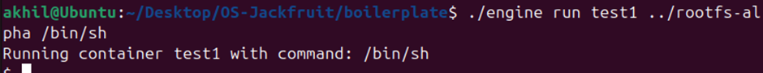
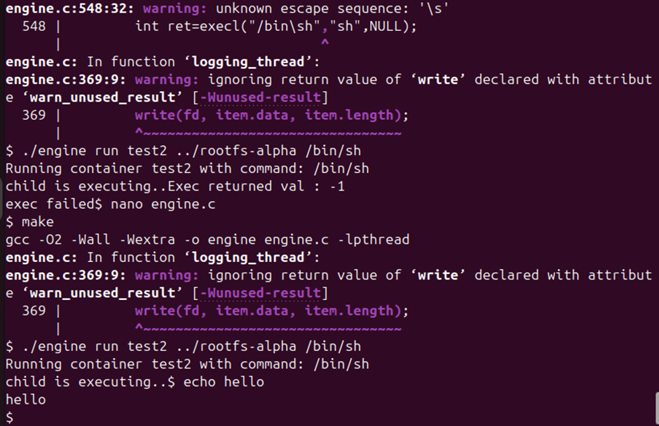
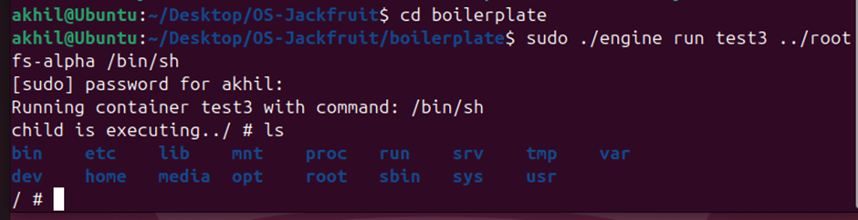
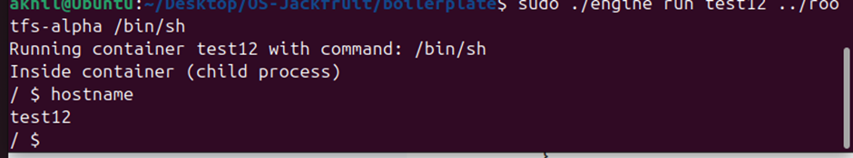
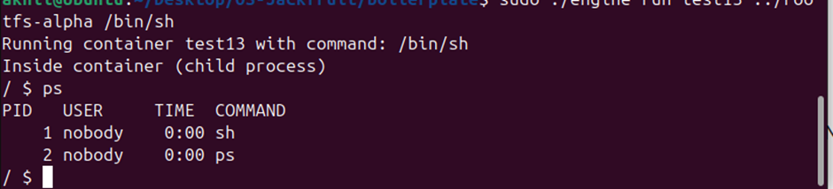
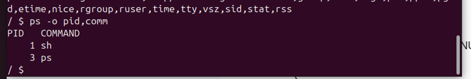
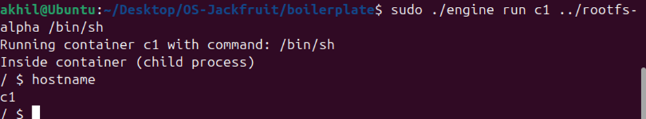
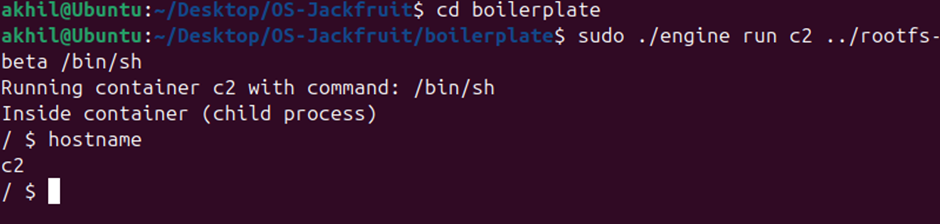

# Multi-Container Runtime (Mini Docker in C)

## Overview

This project implements a lightweight container runtime in C.
It supports process isolation using Linux namespaces, chroot-based filesystem isolation, and basic resource control.

---

## Features Implemented

### 1. Container Execution

* Run containers using `fork` and `exec`
* Execute commands inside isolated environments

### 2. Filesystem Isolation

* Implemented using `chroot`
* Each container uses its own root filesystem (Alpine Linux)

### 3. UTS Namespace

* Each container has its own hostname
* Verified using `hostname` command

### 4. PID Namespace

* Each container has isolated process space
* Verified using `ps` command

### 5. Mount Namespace

* `/proc` mounted inside container

### 6. Process Priority

* Implemented using `nice`
* Allows custom scheduling priority

### 7. Multiple Containers

* Multiple containers executed sequentially
* Each container has independent environment

---

## Screenshots

### Screenshot 1: Basic Execution
### Screenshot 1: Basic Execution


### Screenshot 2: Fork + Exec


### Screenshot 3: Filesystem Isolation (chroot)



### Screenshot 4: UTS Namespace (hostname)



### Screenshot 5: PID Namespace (ps output)



### Screenshot 6: Nice Priority



### Screenshot 7: Container c1



### Screenshot 8: Container c2



---

## How to Run

```bash
make
sudo ./engine run <id> <rootfs-path> /bin/sh
```

---

## Conclusion

This project demonstrates core containerization concepts such as namespaces, process isolation, and filesystem separation, similar to Docker at a simplified level.
